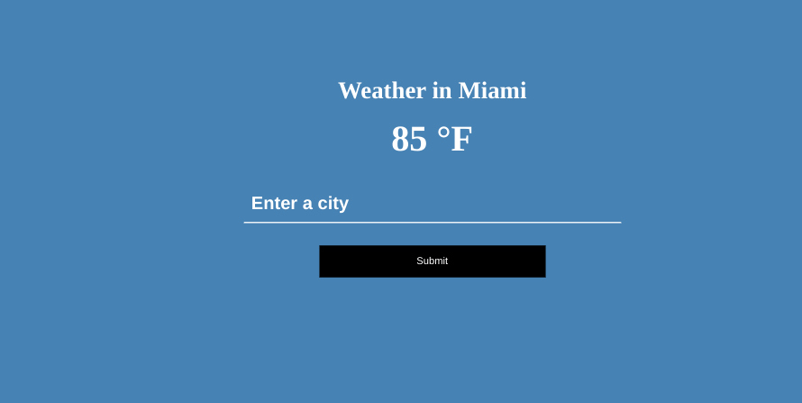

# Node Api Proxy Server 

## Table of contents

- [Overview](#overview)
  - [Screenshot](#screenshot)
  - [Built With](#built-with)
- [Useful Resources](#useful-resources)

## Overview

This is the completed result from this [tutorial](https://www.youtube.com/watch?v=ZGymN8aFsv4).  I did this as research for how I might tackle the [CatWiki Devchallenge](https://devchallenges.io/challenges/f4NJ53rcfgrP6sBMD2jt).

### Screenshot

### Built with

- Express
- Cors
- Dotenv
- Needle

## Useful Resources

- [MDN Docs](https://developer.mozilla.org/en-US/docs/Web/API/URLSearchParams/URLSearchParams) - URLSearchParams
- [Github](https://github.com/cmfcmf/OpenWeatherMap-PHP-Api/issues/46) - openweather api key takes a while to activate